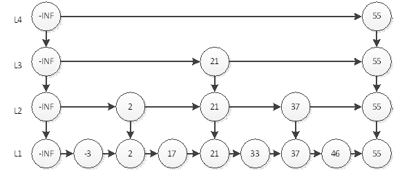

## Java操作有序集合SortedSet
- **插入score和member到有序集合key中:** `jedis.zadd("class1", 123, "xiaoming");`
- **返回有序集合key的基数:** `jedis.zcard("class1");`
- **返回有序集合中score值在min和max之间的成员的数量:** `jedis.zcount("class1", 124, 125);`
- **返回有序集合中score值在min和max之间的成员的member:** `jedis.zrevrangeByScore("class1", 130, 120);`
- **返回指定区间内的成员(score小->大):** `//区间为负为倒序<br>jedis.zrange("class1", 0, -1);`
- **返回指定区间内的成员(score大->小):** `jedis.zrevrange("class1", 0, -1);`
- **使member的score增加increment:** `jedis.zincrby("class1", 12, "xiaoming");`
- **查看member的score:** ` jedis.zscore("class1", "xiaoming");`
- **查看有序集合中member的排名(小->大):** `jedis.zrank("class1", "sad");`
- **移除有序集合中的一个或多个成员,不存在将忽略:** `jedis.zrem("class1","xiaoming","sad","xiaowang")；`

---
#### 用处
- 排行榜应用，取TOP N操作
- 延时任务
- 范围查找

---
#### 深入
* "跳跃列表"
    * 如图
    <br>
        ```
        跳跃表在redis中主要是有序表的一种底层实现。对于普通链表的查找，即使有序，我们也不能使用二分法，需要从头开始，一个一个找，时间复杂度为O(n)。<br>而对于跳跃表，从名字可以看出跳跃表的优势就在于可以跳跃。如何做到呢？<br>在于其特殊的层设计。比如我们查找46，普通链表只能从头开始查找，比对-3,2,17...直到46，要比对7次。但是对于跳跃表，我们可以从最高层开始查找：
    
        第一步：在L4层直接与55比对，发现大了，退回到第3层
    
        第二步：在L3层与21比对，发现小了，继续往前比对55，发现大了，退回到第二层
        
        第三步：在L2层与37比对，发现小了，往前，与55比对，发现大了，退回到第一层
        
        第四步：在第1层，与46比对，查找成功。
        ————————————————
        版权声明：本文为CSDN博主「OliverAAAAAA」的原创文章，遵循 CC 4.0 BY-SA 版权协议，转载请附上原文出处链接及本声明。
        原文链接：https://blog.csdn.net/OliverAAAAAA/article/details/89184018
        ```
     
   
